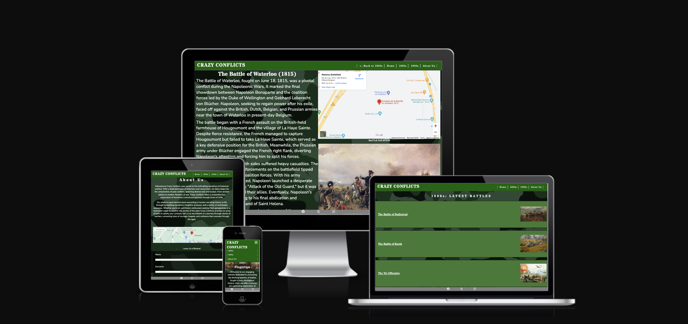
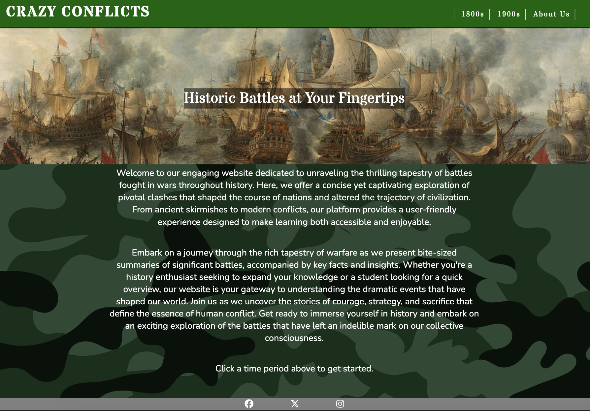
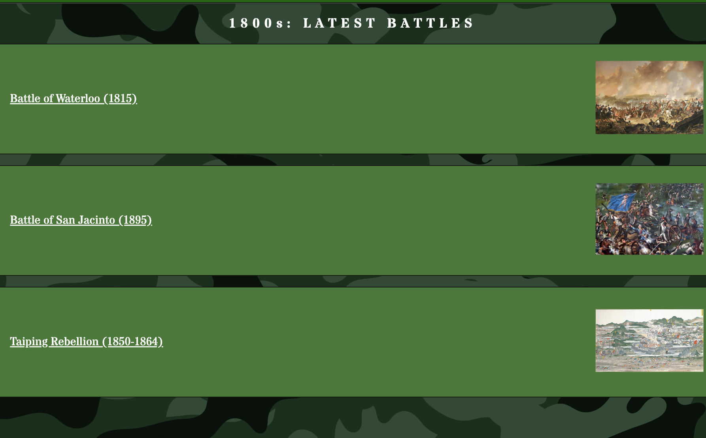
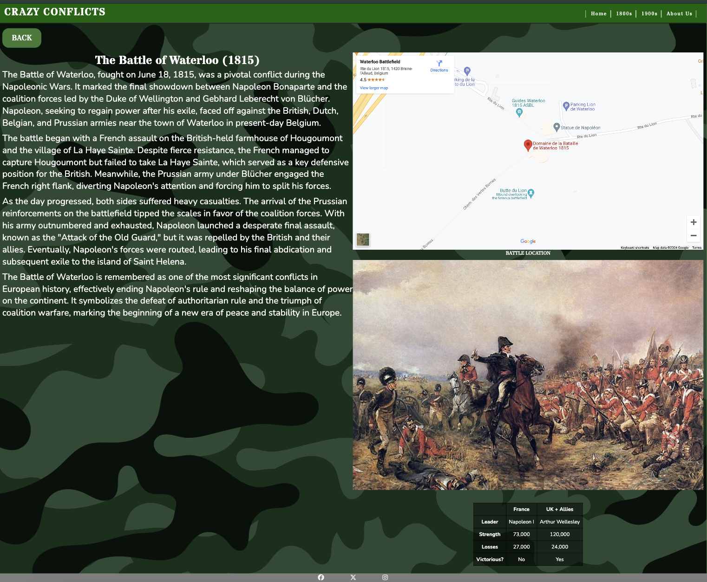
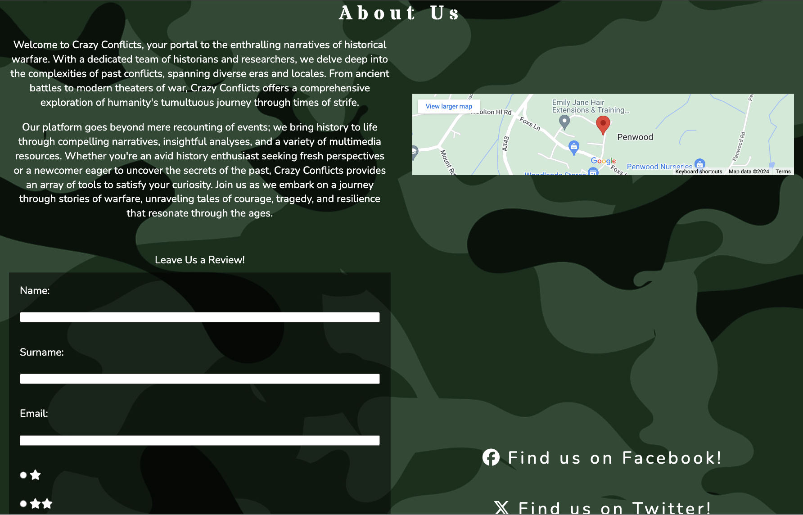

# Crazy Conflicts
Crazy conflicts is an up and coming website designed to give users fast, easily accessible facts and figures regarding the most important battles in history, with frequent updates covering new battles to keep users returning to the site.

## Features

### Navigation Bar
- The navigation bar is featured on every page, and allows users to get around the site. It has links to seperated eras of battles, and if the user is already looking at a specific battle, they can click to go back to the battles of the era they are browsing

- The navigation bar is fully responsive, and switches to a 'burger bar' design which drops down the menu when viewed on a tablet or smaller.

### Home Page
- The home page showcases a large eye catching image with a message inside it and gives an immediately apparent function of the website and the benefits it will bring the user
- The user is welcomed by a short introductory message that provides them with an understanding of what they will find on the website, and has an encouraging tone which promts them to explore the website

### Footer
- The footer contains three different links to social media sites, all of which open in a new tab to provide a good user experience, and they have a good contrast to the background making them easy to see, while not being too distracting and taking away from the focus of the site

### Battle List Page
- The website currently features two pages with lists of the latest battles the service has documented, and these are eye catching from the images displayed alongside each battle
- The battles covered are seperated into different eras, namely the 1800s and 1900s, and the battles appear in a list format, allowing them to be easily updated and added to simply by adding another battle as a list item. This gives the user an impression that the website is dynamic and updated frequently, prompting them to return to find out what other battles have been documented in each era

### Battle Pages
- From each battle list page era, the user can discover individual battles, which has been split into two sections, a description on the left (or appearing first if viewed on a tablet or phone) and visuals on the right to support this description, making the site easy to read and understand, and seperating these out reduces cognitive overload to the user
- The visuals contain a Google Maps iframe of where the battle took place, giving them an understanding of it's location on the planet, an image or artist's rendition of the battle to make them understand the reality of the horrors that took place, and finally a table that provides the user fast facts such as who the leaders of each army were, how big the armies were, etc, making important statistics easy to obtain

### About Us Page
- The about us page has been organised into a grid, seperating each section and allows for a lot of information to be provided to the user while not being overwhelming
- This page begins with a short description about the company and what the aim is with the website, a Google Maps iframe of where to find the company, and a review form that can be submitted, allowing the user to leave their information, a rating of the website between 1 and 5 stars, and even a section where they can leave their own personal comments about the website. 
- Finally, the user's attention is also drawn to the links of social media platforms of which the Crazy Conflicts company is a part of, allowing the user to become more involved with the service, and these links are made more visible in case the user did not take notice of them in the footer.

## Testing

### Am I responsive?

- One way in which the website has been tested, is by making sure that the website can be viewed by any user on any platform, without it becoming distorted and making sure it is accessible for all. 
- In the screenshot above, it shows multiple renderings of the site viewed from different size viewports, and you can see that the website has been designed using display:flex and display:grid CSS stylings, to allow the content to shift around and still appear presentable, even if viewed on very small screens such as the Samsung Galaxy Fold. Additionally, features such as the nav bar changes into a 'burger bar' dropdown menu which appears over the content, allowing the user to navigate this way instead of having the navbar links take up the page at all times.
### Validator Testing
- The website has been vetted using the W3C Markup Validation service, to check for any errors within the HTML. There are no errors within the HTML